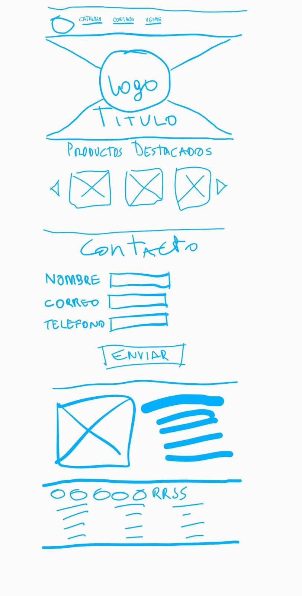

# Descripción de mi proyecto

Este proyecto consiste en una página web tipo landing page.
Se desarrolló desde cero utilizando una variedad de herramientas y tecnologías de desarrollo web para crear una página atractiva, fácil de navegar y adaptable a diferentes dispositivos.

Antes de comenzar a escribir código, se creó un prototipo de baja fidelidad que mostraba la estructura y el diseño general de la página. Este prototipo permitió visualizar el proyecto antes de empezar a codificar para dar una estructura base, sin la rigurocidad de seguir el diseño exactamente como se presentó en el prototipo, ya que este solo tenía como objetivo dar una primera idea de la página de inicio.

Se utilizaron etiquetas estándar HTML5 para crear la estructura básica de la página, lo que garantizó un código limpio, fácil de leer y mantener. Las técnicas de CSS, incluyendo Flexbox y CSS Grids, se utilizaron para crear diseños y disposiciones de página personalizados y responsivos.

Además, se implementó Responsive Web Design utilizando media queries para asegurarse de que la página se viera bien en una variedad de dispositivos y tamaños de pantalla. Las media queries permitieron ajustar el diseño y la disposición de la página en respuesta a diferentes resoluciones de pantalla

Adicionalmente, se utilizó el framework Bootstrap para mejorar la presentación de tarjetas asociadas a un catálogo de productos destacados y para los formularios y de login de usuario. Bootstrap proporcionó una variedad de componentes prefabricados que aceleraron el desarrollo de la página y aseguraron que los elementos de la página se vieran coherentes y estilizados.

En resumen, este proyecto es un ejemplo de cómo se puede aplicar una variedad de habilidades y tecnologías de desarrollo web para crear una página tipo landing page efectiva y atractiva. Al enfocarse en el prototipado, las etiquetas HTML5, las técnicas de CSS, el Responsive Web Design y el framework Bootstrap, se pudo crear una página web que fuera visualmente atractiva, fácil de leer y adaptativa a diferentes dispositivos. Esperamos que esta presentación muestre el valor y el potencial de esta página web como una herramienta efectiva de marketing digital.

# Prototipo del diseño
Prototipo simple y de baja fidelidad para una página tipo landing page, que muestra el diseño básico y la disposición de la página. Utiliza etiquetas estándar HTML5 y se enfoca en la usabilidad y la claridad del contenido

# URL
Link de la página [URL](https://edarvichm.github.io/PROY1_S1_LandingPage/).
